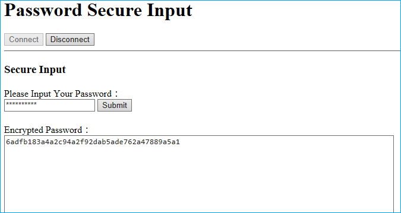
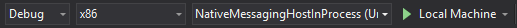
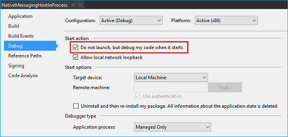

# SecureInput

## About the sample

The SecureInput sample illustrates the use of Native Messaging APIs that allows an Edge extension to communicate with a companion Universal Windows Platform (UWP) application. It also include a [Desktop Bridge](https://developer.microsoft.com/windows/bridges/desktop) (Win32) component, which is written in C# to access functionality that isn't available to the extension or the UWP app.

Once the sample is deployed and the user has established the connection between the extension and the UWP app by selecting "connect", they'll be able to encrypt a password.

This sample has five main components:

1. Test web page
2. Edge extension
2. UWP hosting `AppService` in the main app
3. UWP hosting `AppService` as a background task
4. Desktop Bridge exe

### Test web page

The test web page ([`secureinput.html`](./secureinput.html)) illustrates how to configure a website to interact with the content script of an extension. By using custom events, the web page can pass and receive messages from the content script of the extension, thereby allowing user input to be encrypted via the extension. To test this example, you'll need to host this file.

### Edge extension

The extension is a basic extension that uses both a background and content script. The content script's main functionality is to detect when the user is entering data that needs to be secured. The extension communicates this to the Desktop Bridge component via native messaging. When the user is ready to submit the data, the extension will return an encrypted value back to the website.

### UWP hosting AppService in the main app

By default this sample is setup to have the native messaging host run in the main app. This is implemented in the project's `NativeMessagingHostInProcess`. Native messaging on Edge is supported via [`AppService`](https://msdn.microsoft.com/windows/uwp/launch-resume/how-to-create-and-consume-an-app-service), a mechanism that allows a UWP app to provide service to another UWP app. In this case, Edge, as the host of the extension, is brokering the `AppService` call to the companion UWP that is packaged with the extension.

Note the registration of the `AppService` in the `package.appxmanifest` file that is part of the project. The AppService Name specified in the manifest `"NativeMessagingHostInProcessService"` has to match the parameter that is used in the extension's call to [`runtime.connectNative`](https://developer.mozilla.org/Add-ons/WebExtensions/API/runtime/connectNative) or [`runtime.sendNativeMessage`](https://developer.mozilla.org/en-US/Add-ons/WebExtensions/API/runtime/sendNativeMessage).

JSON messages from the extension are stringified as a value in the first [KeyValue pair](https://msdn.microsoft.com//library/windows/apps/5tbh8a42) of the [ValueSet](https://msdn.microsoft.com/library/windows/apps/dn636131) object.

### UWP hosting AppService in the background task

The only difference between hosting `AppService` in the main app and in the background task is that a background task has a few restrictions. See [Guidelines for background tasks](https://msdn.microsoft.com/windows/uwp/launch-resume/guidelines-for-background-tasks) to determine which option is ideal for your scenario.

To see the background task implementation of the native messaging host, you'll need to edit the extension's background script by changing the string within `port = browser.runtime.connectNative("NativeMessagingHostInProcessService");` to `"NativeMessagingHostOutOfProcess"`.

### Desktop Bridge
This component implements the core functionality that uses .NET Framework APIs to access functionality that are not available to UWP applications. However, because the executable is packaged in an AppX package, it will be able to communicate using `AppService` with the companion UWP application.

To get started with converting a Win32 to Desktop Bridge app, head [here](https://msdn.microsoft.com/windows/uwp/porting/desktop-to-uwp-run-desktop-app-converter).

## Deploying
The solution is currently configured with `NativeMessagingHostInProcess` as the companion UWP. 

The goal of the deployment is to make sure that the Extension and Win32 files are copied to the relevant folders in the packaging location.

This can be done with via the following steps in Visual Studio:

1.	Add a new `Extension` folder to `NativeMessagingHostInProcess` project. Add all the extension files link (instead of local copy) so any changes are reflected in the package. Make sure the properties for them are set to `Build Action`=`Content` and `Copy to Output Directory`=`Copy Always`. 
2.	Add a new `Win32` folder to `NativeMessagingHostInProcess` project and modify the `NativeMessagingHostInProcess` .csproj file to include a PostBuild event to copy all the Win32 binaries to the Win32 folder.
3.	Update `package.manifest` to point to the Win32 binary in the `Win32` folder.
4.	Build and deploy the `NativeMessagingHostinProcess` UWP app.
 

 This will generate:
 -	Necessary binaries and files needed for the UWP app.
 -	The `AppX` folder.
 -	The `AppXManifest.xml` based on the content of `package.manifest`. (The content of `package.manifest` in this sample has been edited to include the necessary entries for Edge extensions).

Once the solution is correctly deployed, you should see the extension in Edge.

## Creating AppX package for Store submission
The steps for creating an AppX package is similar to how one would [create a UWP package using Visual Studio](https://docs.microsoft.com/en-us/windows/uwp/packaging/packaging-uwp-apps#create-an-app-package).

## Debugging
The instructions for debugging vary depending on which component you want to test out:

### Debugging the extension
Once the solution is deployed, the extension will be installed in Edge. Checkout the [Debugging](https://developer.microsoft.com/microsoft-edge/platform/documentation/extensions/guides/debugging-extensions/) guide for info on how to debug an extension.

### Debugging the UWP app
The UWP app will launch when the extension tries to connect to it using [native messaging APIs](https://developer.mozilla.org/Add-ons/WebExtensions/API/runtime/connectNative). You’ll need to debug the UWP app only once the process starts. This can be configured via the project’s property page:

1.	In Visual Studio, right click your `NativeMessagingHostInProcess` project
2.	Select Properties

 
 
3.	Check "Do not launch, but debug my code when it starts"

 

You can now set breakpoints in the code where you want to debug and launch the debugger by pressing F5. Once you interact with the extension to connect to the UWP app, Visual Studio will automatically attach to the process.

### Debugging the Desktop Bridge
Even though there are various [methods for debugging a Desktop Bridge](https://msdn.microsoft.com/windows/uwp/porting/desktop-to-uwp-debug) (converted Win32 app), the only one applicable for this scenarios is the PLMDebug option. You could also add debugging code to the startup function to perform a wait for a specific time, allowing you to attach Visual Studio to the process.
